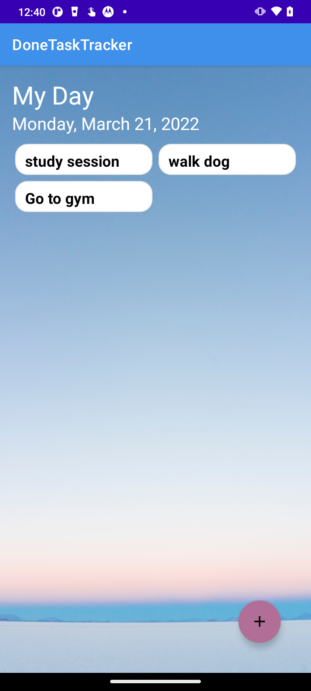
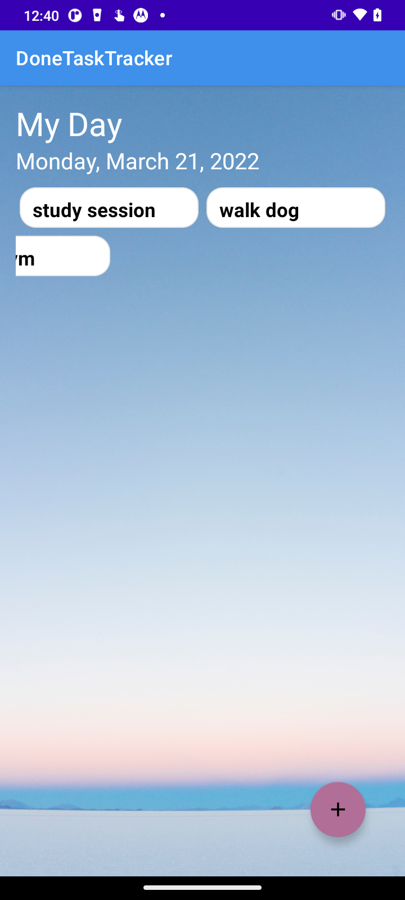
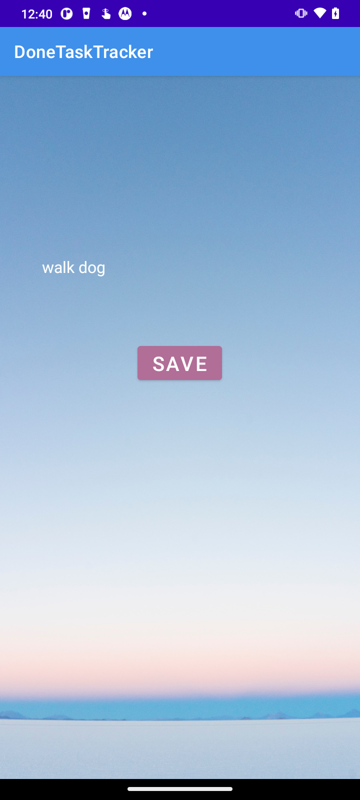

# Done-Task-Tracker-App

## 📑 Table of Contents
* [General Info](#-general-info)
* [Technologies](#-technologies)
* [Setup](#-setup)
* [Preview](#-preview)

## 💁 General Info
This app let's users add a task to the interface, edit an existing task, then swipe to delete once task is completed.
### Android Technologies used to make this project
* RecyclerView
* ViewModel


## 🧰 Technologies
* Android Studio
* Kotlin

## 🔑 Setup
```
Download Android Studio
Download file and open in Android Studio
Run on emulator

```
## 🖼️ Preview
  
